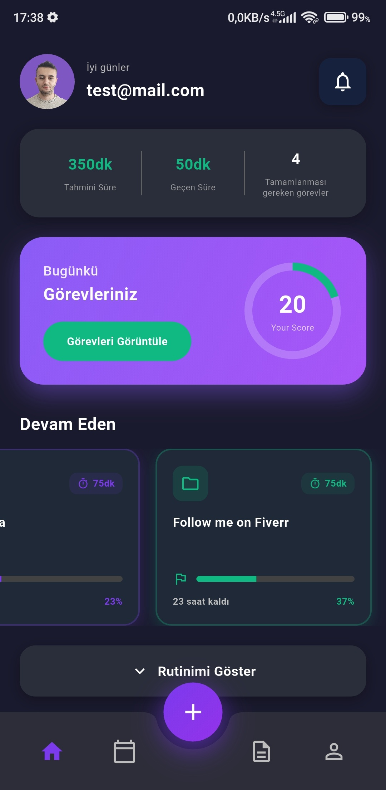
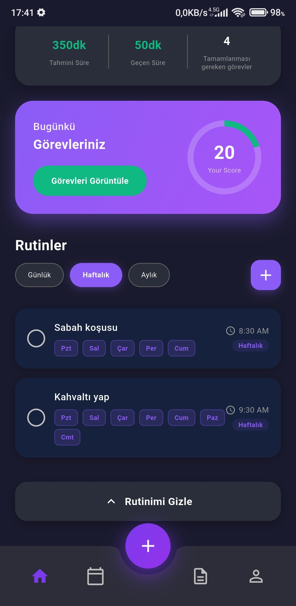

# 👋 Hello, I'm Metehan Yenil  

Welcome to my GitHub profile! 🚀  
I'm a **Flutter Developer** who loves building **mobile applications** and a **Cybersecurity Enthusiast**.  

---

## 🧑‍💻 About Me
- 📱 Developing **cross-platform mobile applications** with **Flutter**  
- 🛡️ Worked in the **Blue Team** in cybersecurity and later transitioned to the **Red Team**  
- ⚙️ Gained valuable knowledge in **system design, deployment, and management** through internships  
- 🌱 Currently **working on my mobile app project** and **studying Web Security vulnerabilities**  
- 🎯 **My Goals:**  
  - Mastering **the latest technologies** in mobile app development to bring projects to life  
  - Improving myself in **cybersecurity**, especially **Web Security**  
  - Advancing my skills in both **mobile app development** and **cybersecurity**

---

## 🌟 Featured Projects

### 📱 **Taskly – Flutter Görev Yönetim Uygulaması**
Kişisel görevlerinizi düzenlemenizi sağlayan hızlı ve modern bir mobil uygulama.  
- Flutter ile geliştirildi  
- SQLite veritabanı  
- Responsive tasarım  
- State Management: **BLoC + Provider**

🔐 **Repo:** Private

#### 📸 **Uygulama Görüntüleri**

  
  

---

## 🚀 Tech Stack & Skills

### **Languages & Frameworks**

---

### **Cybersecurity Tools**

---

### **DevOps & Systems**

---

## 📊 GitHub Stats

---

## 🌍 Contact Me
    

---

## ✨ Fun Fact
> "**I love turning ☕ coffee into 💻 code,  
> and 💡 ideas into 🚀 reality.**"
